# Application Screenshots

This section presents a visual overview of the **SafetyDrones UAV Platform** interface.  
The screenshots below illustrate the main features of the application, including drone management, map visualization, weather monitoring, and user configuration.

---

## Login & Authentication

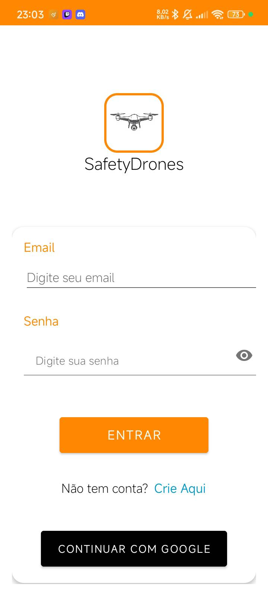
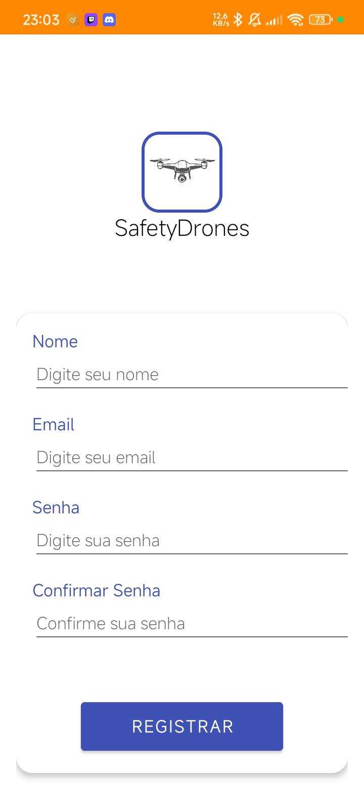

---

## Main Page

---

## Drone Management

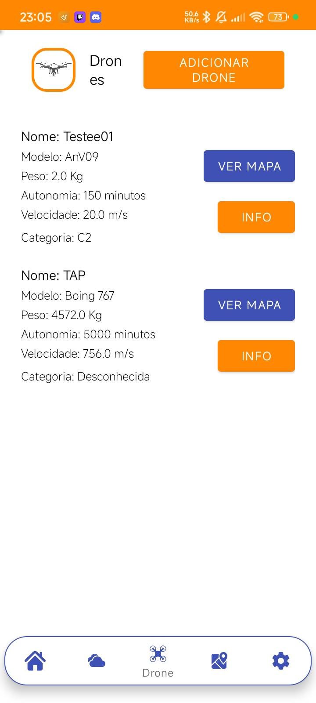

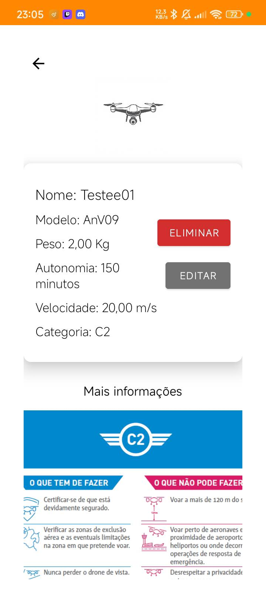

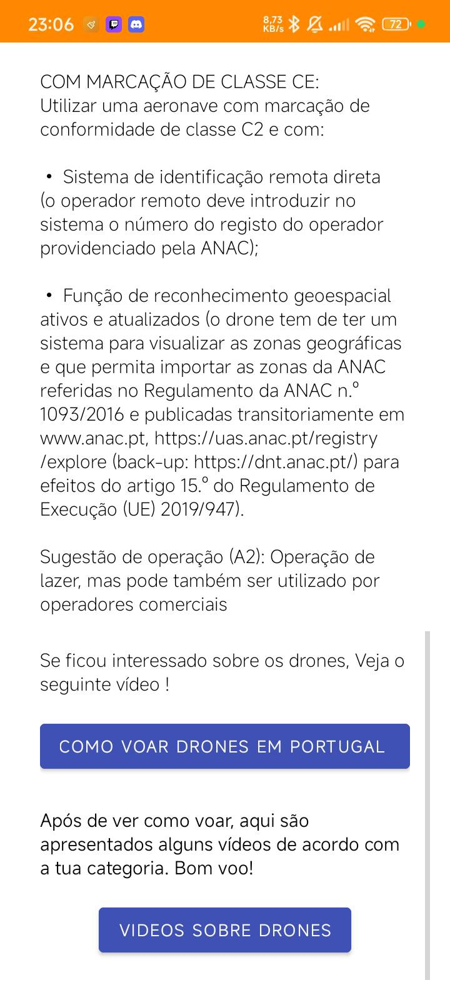

---

## Maps & Flight Zones

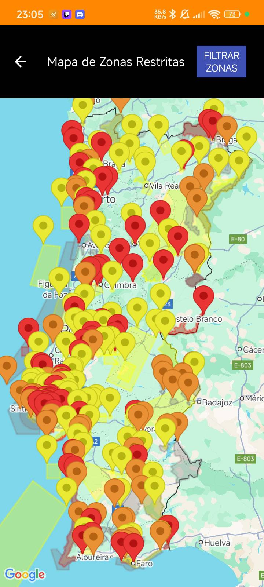
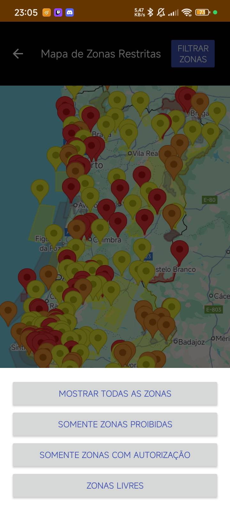

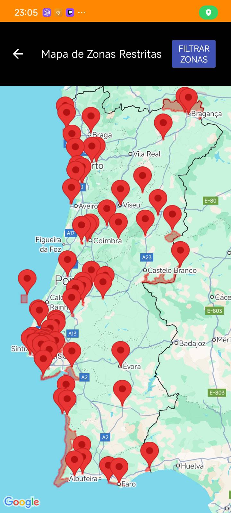
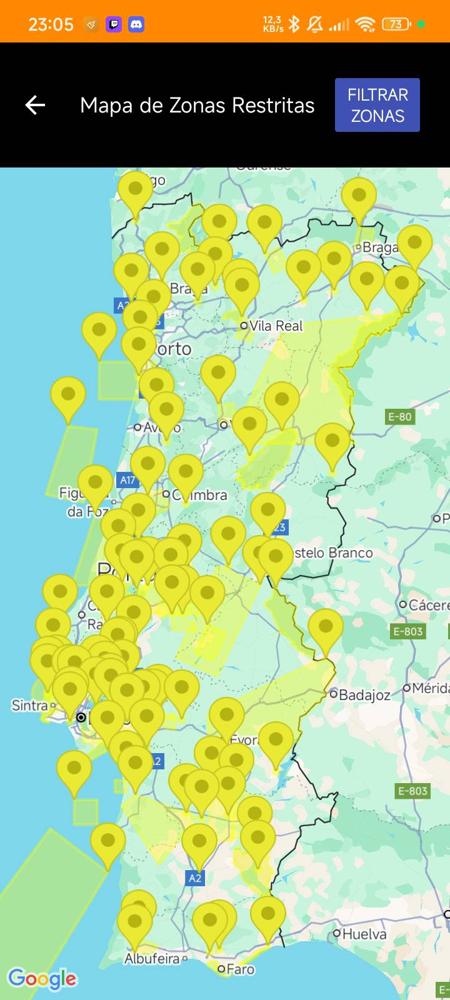

---

## Weather Monitoring

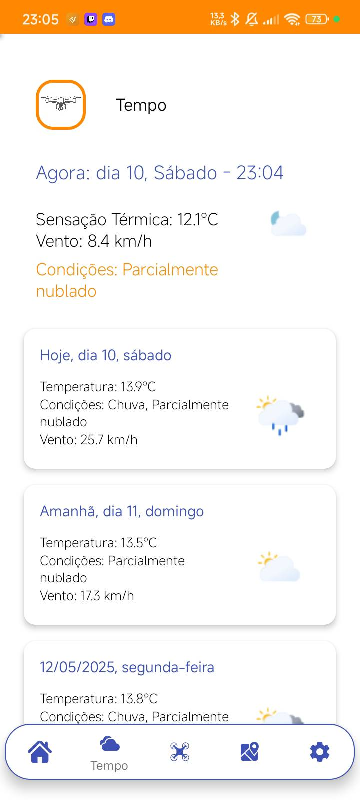

---

## Nearby Restricted Zones

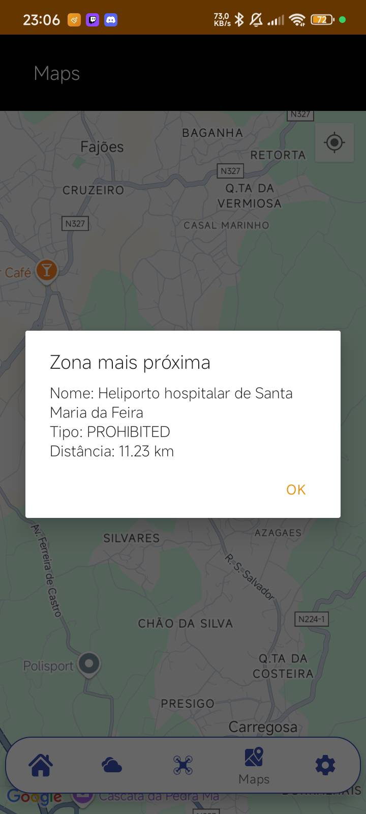
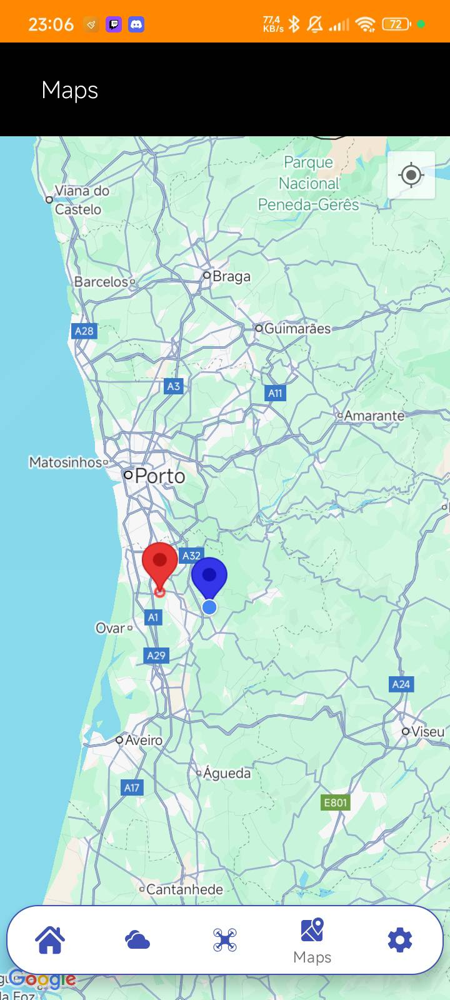

---

## User Configuration

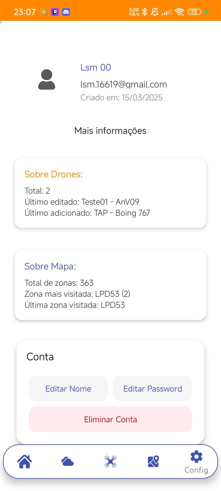
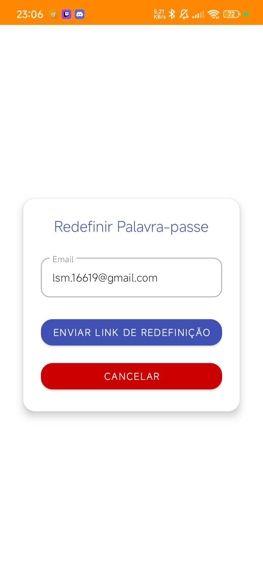

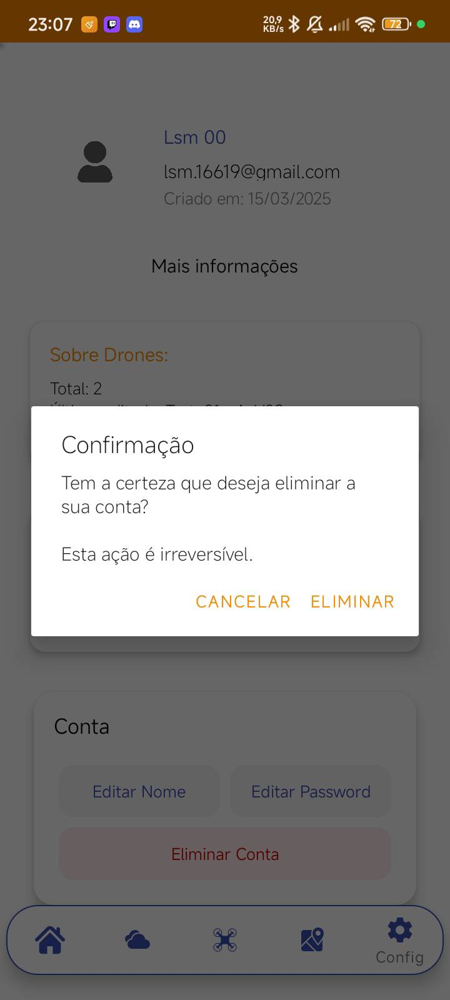

